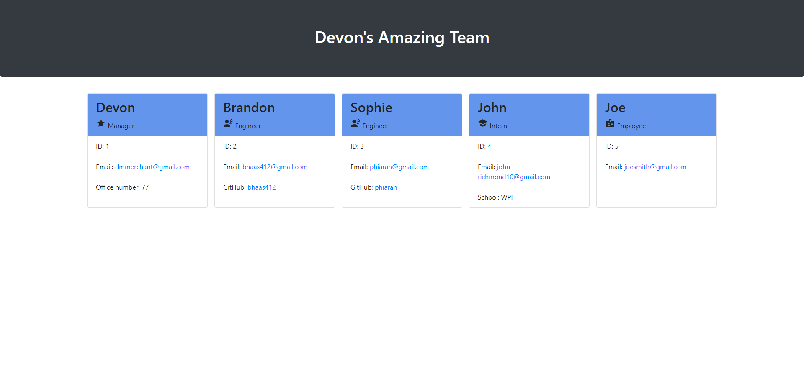

# Team Profile Generator
  

## Description

The Team Profile Generator is a Node.js command-line application that takes in information about employees on a software team and generates an HTML webpage that displays summaries for each person. When a team is created, the user is asked to name the team and then proceeds to add the team members. A manager is required and is the first information that is asked. After that the user can select from the following options: Engineer, Intern, or General Employee. Once the user is done adding members, the system generates an HTML with cards for each employee.

## Table of Contents

- [Installation](#installation)
- [Usage](#usage)
- [Contributing](#contributing)
- [Tests](#tests)
- [Questions](#questions)

## Installation

Use the following code in the command line to install the application:

    npm -i

## Usage

Use the following code in the command line to run the application:

    node index
    
OR 

    npm start

## Contributing

This application does not allow contributions

## Tests

Tests are built for the following classes: 
- Employee
- Engineer
- Intern
- Manager

Use the following code in the command line to run the application:

    npm test

## Questions

GitHub Account:  [dmmerchant](https://github.com/dmmerchant)

Email Address: dmmerchant@gmail.com

